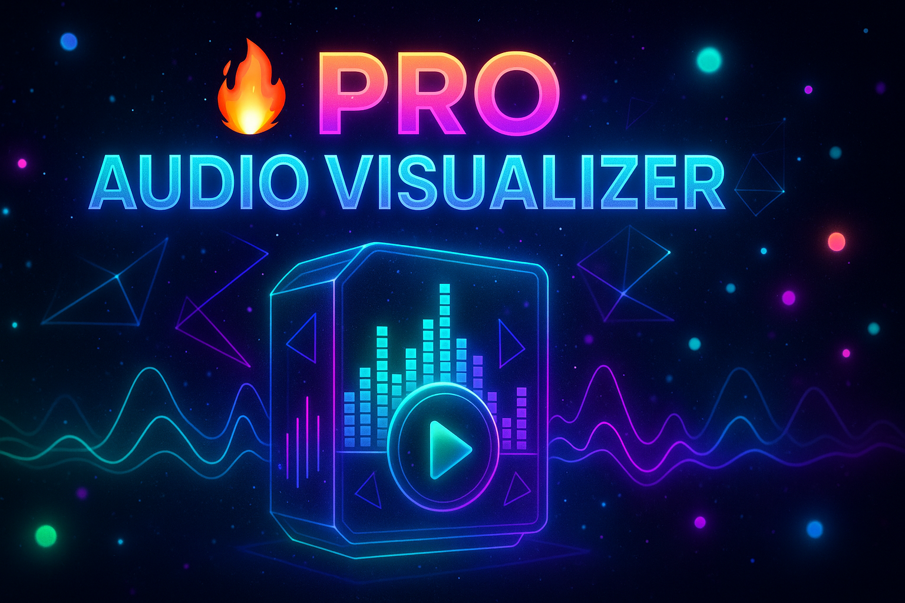
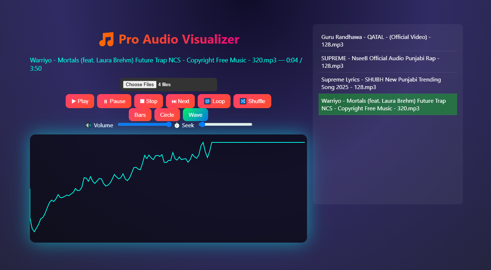

# 🎧 🎵 Pro Audio Visualizer 🔥

A mind-blowing, professional, and real-time audio visualizer built for modern web platforms. Features multiple visualizer styles, custom audio controls, responsive UI, and an animated music-reactive background — all in one.
---



## 🚀 Features

- 🎛️ **Full Audio Controls** — Play, pause, stop, volume, loop, shuffle
- 🌈 **Visualizer Style Switcher** — Bars, Circles, Waves, Dots (real-time swap)
- 🔥 **Color & Glow Themes** — Dynamic UI themes with neon glow effects
- 🧠 **Beat Detection Engine** — Auto-sync animations to rhythm
- 🪐 **Animated Backgrounds** — Music-reactive visuals behind visualizer
- 📟 **Track Info** — Song name, current time, duration & metadata
- 🧩 **Modular Architecture** — Easy to add your own visualizer styles
- ⚡ **60FPS Performance** — Highly optimized for all devices

## 📸 Preview



## 🛠️ Built With

- **HTML5** – Semantic structure
- **CSS3** – Layout, animations, responsiveness
- **JavaScript (ES6+)** – Logic and interactivity
- **Web Audio API** – Real-time audio processing
- **Canvas API** – Drawing smooth reactive visuals
- **requestAnimationFrame** – For buttery animations
- **Mobile-First Principles** – Designed to perform across all devices
- **🔥 Passion for music and creativity**

## 🚀 How to get Started
1. Clone the repo or download the ZIP.
2. Open `index.html` in your browser.
3. Upload an audio file and enjoy the visualization.

## 📁 Getting Started
1. To run this locally:
2. Clone the repo:
   ```bash
   https://github.com/Dev-Suraj-Dhawal/audio-visualizer.git

# Open in browser
cd audio-visualizer
open index.html  # or just double click index.html

## 📜 License
This project is licensed under the MIT License. Feel free to use, modify, and share it!

---

Built with ❤️ to bring music to life with code.